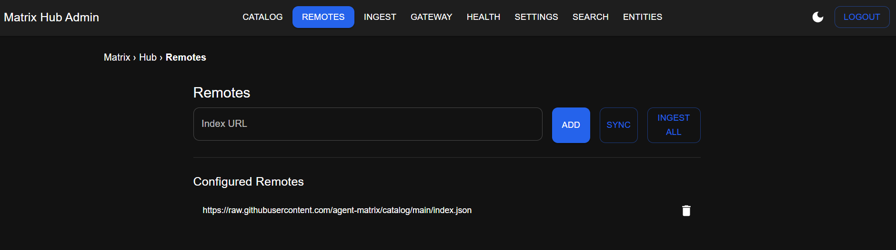

# Matrix-Hub Admin (Next.js + MUI + NextAuth)


A lightweight, modern admin UI to operate **Matrix-Hub** and **MCP Gateway** from your browser.
Scaffolded on the Refine Next.js template, but implemented with **custom Next.js Pages**, **MUI** for UI, **NextAuth** for authentication, and **axios** clients for Hub/Gateway APIs.

---

## ✨ Features

* **Authentication**

  * NextAuth **Credentials** provider (configurable admin user/password)
  * Protected routes by default; **/login** is public
  * **Login/Logout** buttons in the top bar
* **Dark / Light mode**

  * One-click toggle in the navbar, persisted in `localStorage`
* **Unified layout & navigation**

  * Top AppBar with active-page highlighting
  * Breadcrumb slot on each page
* **Remotes**

  * Add/List/Delete remote index URLs
  * **Sync** (ingest + gateway re-affirm)
  * **Ingest All** (trigger hub ingest across all remotes)
* **Catalog**

  * **Search** with filters (type, capabilities, frameworks, providers)
  * Modes: **keyword / semantic / hybrid**, **rerank**: none / llm, optional **RAG fit reason**
  * One-click **Install** to target path
  * **Entities** (DB-backed list) and **Entity details** view with install
* **Gateway**

  * Register an MCP server (name, URL, transport: `SSE | HTTP | STREAMABLEHTTP | STDIO`)
* **Health**

  * Status cards for Hub and Gateway with **OK/DOWN**, latency, last-checked timestamp
* **Settings**

  * Configure **Hub/Gateway tokens** (masked input, show/hide, clear)
  * Read-only Hub/Gateway URLs from env

---

## 🧩 Tech stack

* **Next.js (Pages Router)**
* **MUI** (Material UI)
* **NextAuth** (Credentials)
* **axios** (API clients)
* **TypeScript**
* **Makefile** & **Dockerfile** (Next.js standalone build)

---

## 🚀 Quick start

> Requires Node.js 18+ and npm.

### 1) Scaffold & enhance (scripts)

If you’re using the provided scripts:

```bash
# 1) Create the project (interactive refine scaffold + core wiring)
bash ./1-core.sh --install --init-git

# 2) Add Matrix-Hub features (Search, Entities, enhanced Remotes)
cd matrix-hub-admin
bash ../2-addon.sh
```

> You can re-run `2-addon.sh` safely; it only overwrites files it owns.

### 2) Configure environment

Copy the template and edit values:

```bash
cp .env.local.example .env.local
```

`./.env.local`:

```ini
# NextAuth
NEXTAUTH_URL=http://localhost:3000
NEXTAUTH_SECRET=change-me-in-prod
ADMIN_USER=admin
ADMIN_PASS=admin123

# Matrix-Hub & MCP-Gateway (browser-visible)
NEXT_PUBLIC_HUB_URL=http://127.0.0.1:7300
NEXT_PUBLIC_GW_URL=http://127.0.0.1:4444

# Optional: tokens can also be set from the Settings page at runtime
NEXT_PUBLIC_HUB_TOKEN=
NEXT_PUBLIC_GW_TOKEN=
```

### 3) Run

```bash
npm install
npm run dev
```

Open [http://localhost:3000](http://localhost:3000) → you’ll be redirected to **/login**.
Use the credentials from `.env.local` (default: `admin / admin123`).

---

## 🗂 Project structure (high level)

```
matrix-hub-admin/
├─ src/
│  ├─ components/
│  │  └─ Layout.tsx               # Shared app shell (navbar, theme toggle, auth buttons)
│  ├─ lib/
│  │  ├─ api.ts                   # axios clients: hub & gw (Bearer token headers)
│  │  ├─ settings.ts              # token getters/setters (localStorage) + URLs
│  │  └─ query.ts                 # tiny helper to compact query params
│  ├─ pages/
│  │  ├─ api/auth/[...nextauth].ts# NextAuth (Credentials; pages.signIn=/login)
│  │  ├─ login.tsx                # Public sign-in form
│  │  ├─ index.tsx                # Redirect → /catalog (or your preferred start)
│  │  ├─ remotes.tsx              # Add/List/Delete; Sync; Ingest All
│  │  ├─ ingest.tsx               # Trigger ingest (optional URL)
│  │  ├─ catalog.tsx              # Install by UID to target path
│  │  ├─ search.tsx               # Catalog search + one-click install
│  │  ├─ entities/
│  │  │  ├─ index.tsx             # Entities list (DB-backed)
│  │  │  └─ [id].tsx              # Entity detail + install
│  │  ├─ gateway.tsx              # Register server in MCP Gateway
│  │  ├─ health.tsx               # Status cards for Hub & Gateway
│  │  └─ settings.tsx             # Set tokens (masked), clear, show/hide
│  ├─ theme.tsx                   # MUI theme + ColorModeProvider (dark/light)
│  └─ types/
│     └─ hub.ts                   # Typed models for search, entities, remotes, install
├─ Dockerfile                     # Next.js standalone image
├─ Makefile                       # dev/build/start/docker targets
├─ next.config.js                 # output: 'standalone', strict mode
├─ .env.local.example
└─ README.md
```

---

## 🔐 Auth & security

* **Auth**: NextAuth with **Credentials** (JWT sessions).
  Configure `ADMIN_USER`, `ADMIN_PASS`, and `NEXTAUTH_SECRET` in `.env.local`.
  The app protects all pages by default; only **/login** is public.

* **Tokens**

  * Hub/Gateway tokens are **not** secrets in this UI and are stored in the browser’s `localStorage` (for convenience in dev).
  * For **production**, prefer a small Next.js **API route proxy** that reads tokens from secure **httpOnly cookies** and forwards to Hub/Gateway. That way, tokens never reach the browser.
  * Ensure **CORS** settings on Hub/Gateway allow your frontend origin for the endpoints you call.

---

## 🔗 API assumptions

**Matrix-Hub** (examples):

* `GET  /health`
* `GET  /remotes`
* `POST /remotes` `{ url }`
* `DELETE /remotes` `{ url }` (JSON body)
* `POST /remotes/sync` `{}`
* `POST /ingest` `{ url?: string | null }`
* `GET  /catalog` (DB-backed list)
* `GET  /catalog/search` (filters/modes/rerank/with\_rag)
* `GET  /catalog/entities/:uid` (details)
* `POST /catalog/install` `{ id, target, version?, manifest?, source_url? }`

**MCP Gateway** (examples):

* `GET  /health`
* `POST /gateways` `{ name, url, transport, description? }`

Both axios clients (hub/gw) attach `Authorization: Bearer <token>` if set.

---

## 🧭 Typical workflow

1. **Add a remote index**: `/remotes` → paste index URL → **Add**
2. **Ingest**: either `/remotes` → **Ingest All** or `/ingest` (single URL or all)
3. **Browse & install**:

   * `/search` → filter results (type, capabilities, frameworks, providers, mode, rerank) → **Install**
   * or `/entities` → open an entity → **Install**
4. **Register in Gateway**: `/gateway` → enter server name/URL/transport → **Register Server**

   > Depending on your Hub setup, the install flow may also assert/register servers automatically.

---

## 🧪 Development scripts

**npm scripts**

```bash
npm run dev     # start dev server
npm run build   # production build
npm run start   # run production
```

**Makefile**

```bash
make dev
make build
make start
make docker-build
make docker-run APP_PORT=8080
make docker-stop
make docker-logs
make clean
```

---

## 🐳 Docker

Build & run with the Makefile:

```bash
make docker-build
make docker-run APP_PORT=8080
```

Or directly:

```bash
docker build -t matrix-hub-admin:latest .
docker run --rm -d -p 8080:3000 --name matrix-hub-admin --env-file .env.local matrix-hub-admin:latest
```

---

## 🛠 Troubleshooting

* **404 at /**
  The home page redirects to `/catalog`. If you see 404, ensure `src/pages/index.tsx` exists and your dev server restarted.
* **Unauthorized / admin pages redirect to /login**
  You’re unauthenticated or session expired. Log in at `/login`.
* **Hub/Gateway calls fail**
  Confirm `NEXT_PUBLIC_HUB_URL` / `NEXT_PUBLIC_GW_URL` and tokens in **Settings**. Check CORS rules on the servers.
* **DELETE /remotes**
  FastAPI often expects JSON body on DELETE; this UI sends `{ data: { url } }`.

---

## 🧼 Code style & accessibility

* MUI theming with color-mode toggle (persisted).
* Active nav link uses `aria-current="page"`.
* Health results expose status via `aria-live="polite"`.
* Buttons/controls include descriptive labels.


---

## 🙌 Contributing

Issues and PRs are welcome. Please include:

* Repro steps (for bugs)
* Before/after screenshots (for UI changes)
* API contract notes if endpoints change

---

## ✅ Checklist before production

* [ ] Replace credentials auth with your provider of choice (OIDC / SSO) or keep Credentials with strong secrets
* [ ] Move tokens to secure **httpOnly cookies** behind a **Next.js API proxy**
* [ ] Configure CORS on Hub/Gateway to the production origin
* [ ] Add monitoring/alerts and Docker `HEALTHCHECK` if containerized
* [ ] Review `.env` and disable any `NEXT_PUBLIC_*` secrets (never expose secrets client-side)
