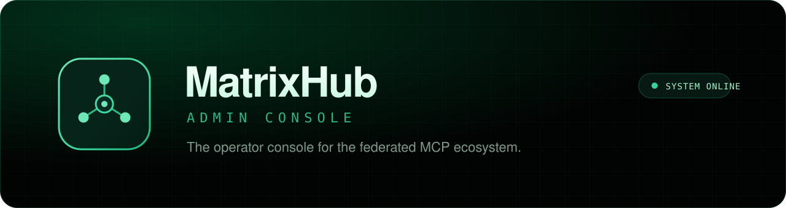
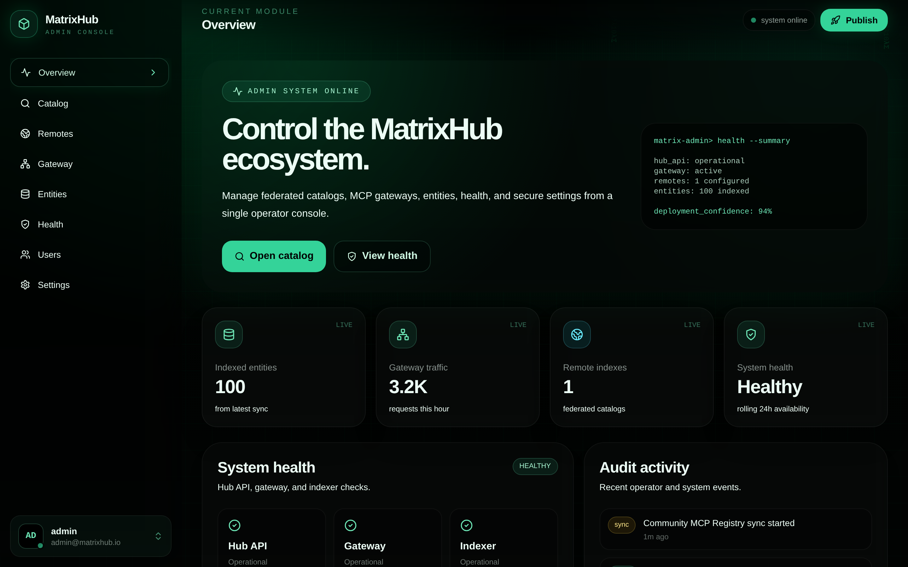
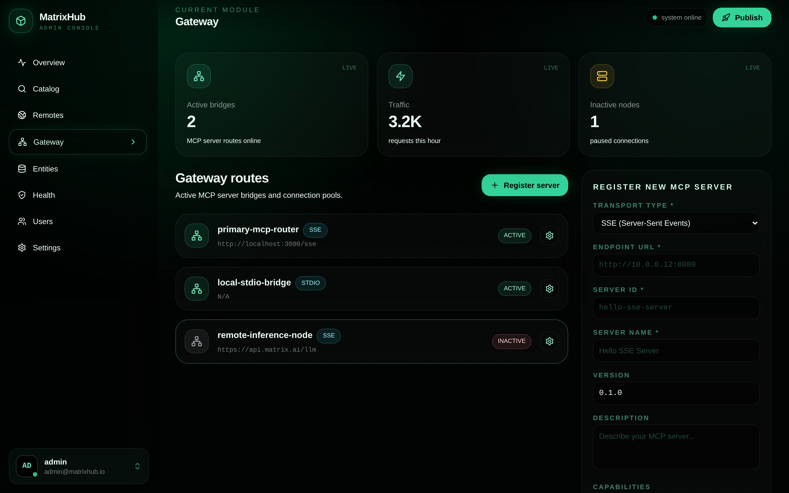
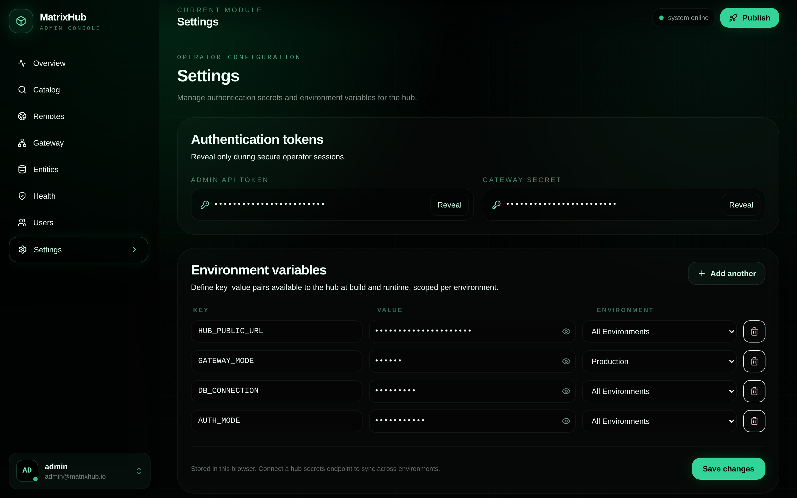
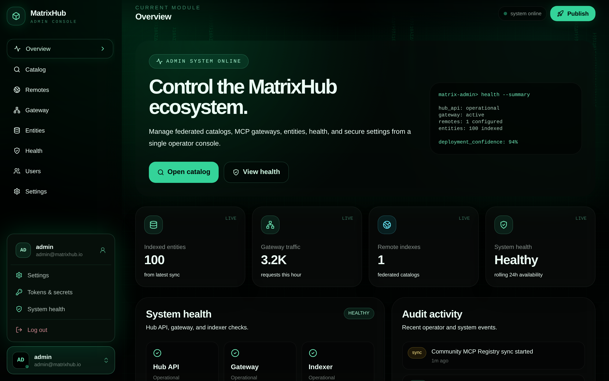
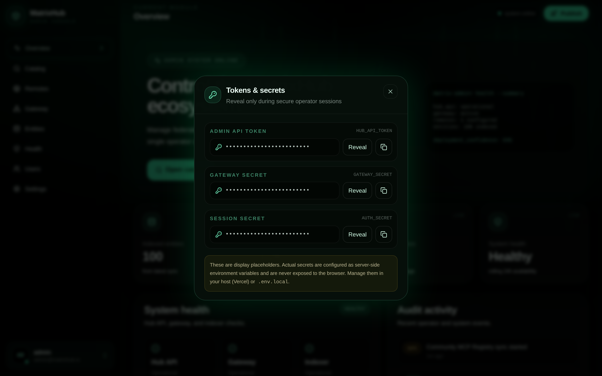
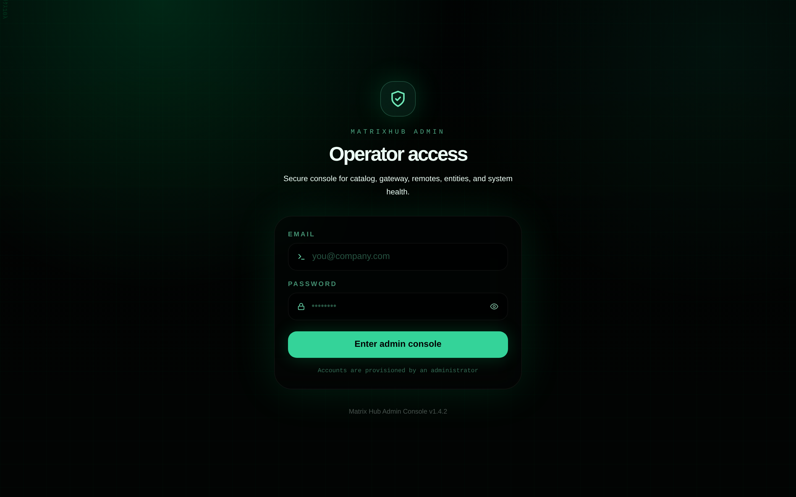

<div align="center">



<br/><br/>

**One console to run your entire MCP ecosystem — catalog, gateway, remotes, and users.**


[**Get Started**](#-get-started) · [**Live Install Guide**](docs/INSTALLATION.md) · [**Architecture**](docs/ARCHITECTURE.md) · [**Deploy**](#-deploy-in-minutes)

</div>

---

## Run the federated catalog like a product, not a config file

**MatrixHub Admin** is the operator console for [Matrix Hub](https://api.matrixhub.io).
Publish servers and tools, federate catalogs, manage your MCP gateway, and
govern who has access — all from one fast, secure, beautifully designed
interface that runs on Vercel or your own infrastructure.

<div align="center">

| 🚀 **Ship in minutes** | 🔐 **Secure by default** | 🏢 **Multi-tenant** | 🎯 **Operator-grade** |
|:---:|:---:|:---:|:---:|
| Deploy to Vercel, point a domain, done | Server-side tokens, JWT sessions, email-verified users | Workspaces, roles, and isolation built in | A real command center, not a dashboard skin |

</div>

---

## ✨ What you can do

- **🔍 Catalog & publish** — Search the federated catalog of MCP agents, tools, and servers; publish new ones and remove what you don't need.
- **🌐 Federate remotes** — Add upstream catalog indexes, trigger sync, and watch status in real time.
- **⚡ Manage the gateway** — Register MCP servers over SSE, STDIO, WebSocket, or HTTP — and decommission them safely.
- **🗄️ Inspect entities** — Browse every ingested entity with versions and capabilities.
- **📊 Monitor health** — Hub, gateway, and indexer checks with error-rate and throughput at a glance.
- **👥 Govern access** — Create users, assign roles, and revoke access across workspaces — every account email-verified.
- **⚙️ Configure safely** — Reveal tokens on demand and manage environment variables, Vercel-style.

---

## 🔐 Built for on-prem teams

MatrixHub Admin follows a **single-root, admin-provisioned** model — perfect for
self-hosted deployments:

- **First run creates one root admin.** Public signup is disabled from day one.
- **Admins create every other user**, assign roles (`owner` › `admin` › `member` › `viewer`), and revoke access.
- **Email verification is required** for every new account, powered by [Resend](https://resend.com).
- **Workspaces (tenants)** keep teams and data cleanly separated.

---

## 📸 See it in action

<div align="center">










<sub>Overview · Gateway · Settings · account menu · tokens & secrets · sign-in</sub>

</div>

---

## 🚀 Get Started

```bash
git clone https://github.com/agent-matrix/matrix-hub-admin.git
cd matrix-hub-admin
npm install
npm run dev          # http://localhost:3000
```

No database yet? Sign in with **`admin / admin`** to explore the UI instantly.
Ready for the real thing? Follow the **[Installation Guide](docs/INSTALLATION.md)**
to connect Postgres, email, and your domain.

---

## ☁️ Deploy in minutes

[](https://vercel.com/new/clone?repository-url=https://github.com/agent-matrix/matrix-hub-admin)

1. Import the repo into Vercel — Next.js is auto-detected.
2. Add your environment variables (Postgres, `AUTH_SECRET`, Resend, hub URL).
3. Point your domain (e.g. `admin.matrixhub.io`) and go live.

The **[Installation Guide](docs/INSTALLATION.md)** covers the custom domain,
Cloudflare DNS, database migration, and email setup step by step.

---

## 📚 Documentation

| Guide | What's inside |
|---|---|
| **[Installation](docs/INSTALLATION.md)** | On-prem setup, environment variables, database, root admin, custom domain, CI secrets, troubleshooting. |
| **[Architecture](docs/ARCHITECTURE.md)** | System design, stack, API surface, data model, project structure, security model. |

---

## 🛠️ Built with

[Next.js](https://nextjs.org) · [React](https://react.dev) · [TypeScript](https://www.typescriptlang.org) · [Tailwind CSS](https://tailwindcss.com) · [Neon Postgres](https://neon.tech) · [Resend](https://resend.com)

---

## 🤝 Contributing

Contributions are welcome — keep `npm run lint` and `npm run build` green, use
conventional commits, and update docs when behavior changes. See
[CONTRIBUTING.md](CONTRIBUTING.md).

## 📄 License

Released under the **Apache License 2.0** — see [LICENSE](LICENSE).

## 💬 Support

- **Issues:** <https://github.com/agent-matrix/matrix-hub-admin/issues>
- **Security:** [SECURITY.md](SECURITY.md)

<div align="center"><sub>Built for the Matrix ecosystem.</sub></div>
